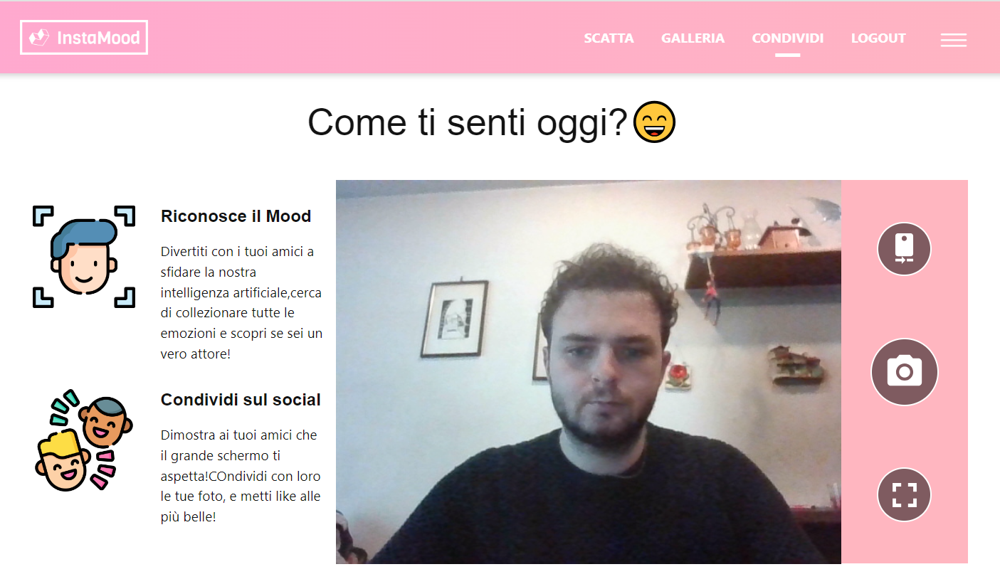
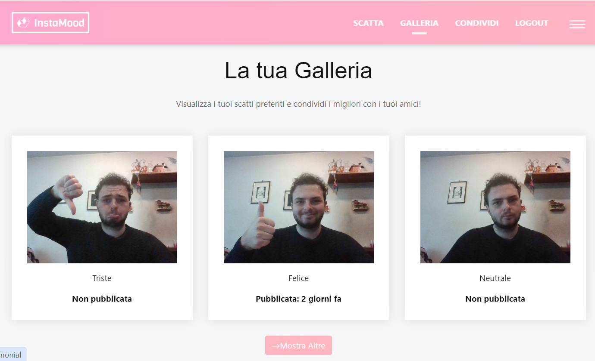
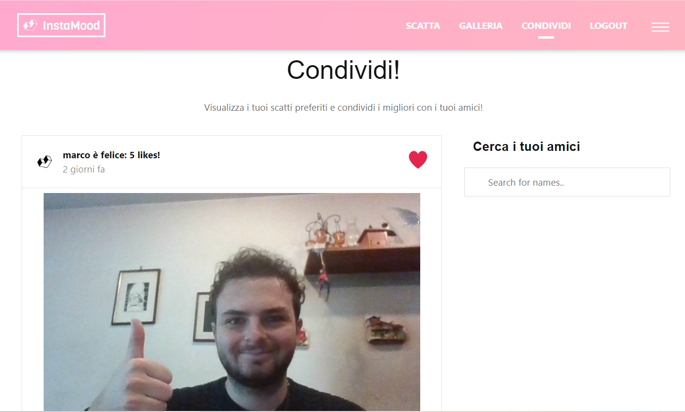
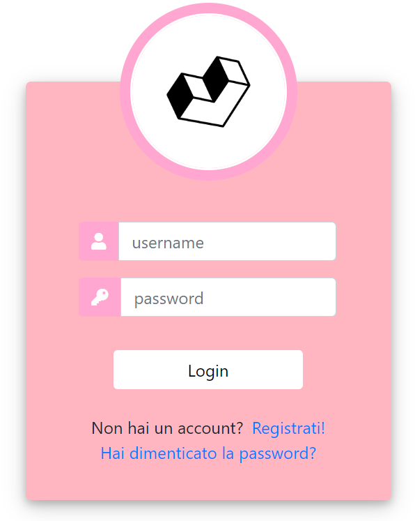
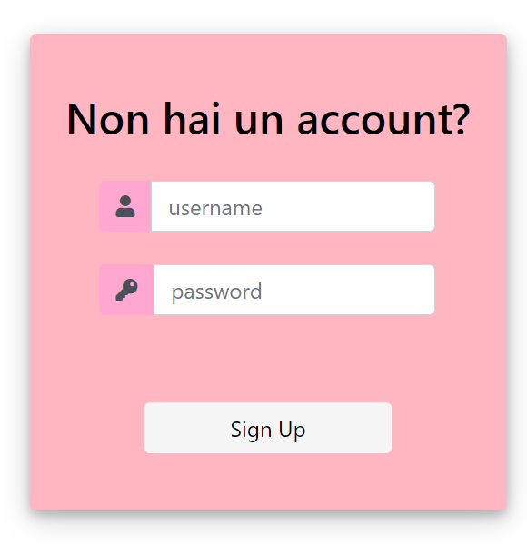

# Instamood

Instamood is a one page web application that connects to the camera of your device. Using Artificia Intelligence, specifically deep learning, 
it can recognize your mood and emotions, while offering a variety of features such as filters and a photo gallery.
You can also share your pictures, along with the recognized mood, with your friends through a simple social network feed mechanism.

## Mood Recognition

The emotion analysis of the user is possible thanks to the *MorphCast* JavaScript library, "the world's smallest facial emotion recognition AI". It requires a license from the MorphCast team to function.

## Technologies Used

- php
- javascript
- bootstrap css
- SQL database

## UI

### Camera Interface

    

### Gallery

    

### Social Network Feed

    

### Login

